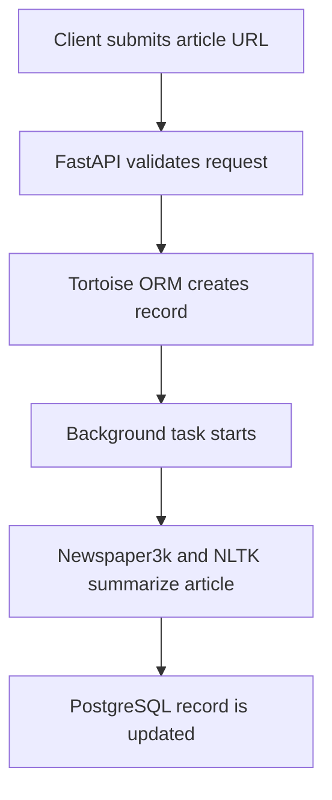

# URL Summary API

[](https://github.com/pavlapintaric235/url-summary-api/actions/workflows/main.yml)


A containerized REST API that accepts the URL of a web article, extracts its content, generates a text summary, and stores the result in a PostgreSQL database.

The project was built with test-driven development (TDD). It includes asynchronous CRUD operations, request validation, background processing, database migrations, unit and integration tests, Docker-based development and production environments, and an automated GitHub Actions deployment pipeline.

## Live API

- [Interactive Swagger UI](https://pure-shelf-80408-af52b72d1688.herokuapp.com/docs)
- [Health check](https://pure-shelf-80408-af52b72d1688.herokuapp.com/ping)
- [GitHub Actions workflow](https://github.com/pavlapintaric235/url-summary-api/actions)

> The deployed application is an API rather than a traditional website, so the best entry point is `/docs`, not the root URL.

## Demo

### Interactive API documentation

FastAPI automatically generates interactive OpenAPI documentation. From this page, users can inspect every endpoint, view the request and response schemas, and send requests directly from the browser.


### Generated summary response

After submitting an article URL, the API stores the URL, processes the article in a background task, and saves the generated summary. The completed record can then be retrieved by its ID.


## Key Features

- Create a summary request from a valid HTTP or HTTPS URL.
- Extract and parse article text with Newspaper3k.
- Generate an extractive summary with Newspaper3k and NLTK.
- Process summarization as a FastAPI background task.
- Store URLs, summaries, and creation timestamps in PostgreSQL.
- Read one summary or list all stored summaries.
- Update and delete existing summaries.
- Validate request bodies and path parameters with Pydantic.
- Return appropriate `201`, `404`, and `422` HTTP responses.
- Manage database schema changes with Aerich migrations.
- Test API behavior at both unit and database-integration levels.
- Build, test, publish, and deploy containers through GitHub Actions.

## How It Works



The request passes through the application in the following order:

1. The client sends a `POST` request to `/summaries/` with an article URL.
2. Pydantic checks that the request contains a valid HTTP or HTTPS URL.
3. The CRUD layer creates a `TextSummary` database record with an empty summary.
4. The API returns the new record ID and schedules `generate_summary()` as a background task.
5. Newspaper3k downloads and parses the article.
6. NLTK provides the tokenizer data used by Newspaper3k's NLP processing.
7. The generated summary is written back to the existing PostgreSQL record.
8. The client retrieves the completed record with `GET /summaries/{id}/`.

Because the summarization runs in the background, a record may briefly contain an empty `summary` value if it is requested immediately after creation.

## API Endpoints

| Method | Endpoint | Description |
| --- | --- | --- |
| `GET` | `/ping` | Return the application health, environment, and testing state. |
| `POST` | `/summaries/` | Create a summary request and start background processing. |
| `GET` | `/summaries/` | Return all stored summaries. |
| `GET` | `/summaries/{id}/` | Return one summary by ID. |
| `PUT` | `/summaries/{id}/` | Update the URL and summary for an existing record. |
| `DELETE` | `/summaries/{id}/` | Delete an existing summary. |
| `GET` | `/docs` | Open the interactive Swagger UI documentation. |
| `GET` | `/redoc` | Open the ReDoc documentation. |

### Create a summary

Request:

```bash
curl -X POST \
  "https://pure-shelf-80408-af52b72d1688.herokuapp.com/summaries/" \
  -H "Content-Type: application/json" \
  -d '{"url":"https://example.com/article"}'
```

Example response:

```json
{
  "url": "https://example.com/article",
  "id": 1
}
```

### Retrieve the completed summary

```bash
curl "https://pure-shelf-80408-af52b72d1688.herokuapp.com/summaries/1/"
```

Example response:

```json
{
  "id": 1,
  "url": "https://example.com/article",
  "summary": "The generated article summary appears here.",
  "created_at": "2026-08-16T12:00:00Z"
}
```

## Technologies

| Technology | Role in the project |
| --- | --- |
| Python 3.13 | Main programming language. |
| FastAPI | Async API framework, routing, dependency injection, background tasks, and OpenAPI documentation. |
| Pydantic | Request validation and API schemas. |
| Tortoise ORM | Asynchronous database models and CRUD queries. |
| PostgreSQL 17 | Development and production relational database. |
| Aerich | Tortoise ORM database migrations. |
| Newspaper3k | Article downloading, parsing, and summary generation. |
| NLTK | Tokenizer data used during article NLP processing. |
| Pytest | Unit and integration testing. |
| HTTPX/TestClient | HTTP-level API testing. |
| Docker | Reproducible development and production images. |
| Docker Compose | Local FastAPI and PostgreSQL service orchestration. |
| Gunicorn and Uvicorn | Production ASGI application serving. |
| GitHub Actions | Continuous integration and delivery. |
| GitHub Container Registry | Storage for built Docker images. |
| Heroku | Production container hosting and managed PostgreSQL. |

## FastAPI Application Design

`app/main.py` creates the FastAPI application and registers two routers:

- `ping.py` provides the health-check endpoint.
- `summaries.py` provides the summary CRUD endpoints.

The summary router is intentionally separated from the database queries. Endpoint functions handle HTTP concerns such as validation, status codes, background tasks, and errors, while `crud.py` contains the Tortoise ORM operations. This separation keeps the code easier to test and maintain.

Pydantic models define the accepted payloads:

- `SummaryPayloadSchema` requires a valid HTTP or HTTPS URL.
- `SummaryResponseSchema` returns the created record ID and URL.
- `SummaryUpdatePayloadSchema` requires both the URL and updated summary.
- `SummarySchema` is generated from the Tortoise model for complete database responses.

## Web Scraping and Summarization

The summarization logic is located in `app/summarizer.py`.

```python
article = Article(url)
article.download()
article.parse()
article.nlp()
```

Newspaper3k downloads the target page and extracts the article content from its HTML. NLTK's `punkt_tab` tokenizer data is checked and downloaded when necessary. Newspaper3k then performs NLP processing and produces `article.summary`.

This is extractive NLP summarization, not a generative AI or LLM call. The application does not send article content to an external AI provider.

The final summary is persisted asynchronously:

```python
await TextSummary.filter(id=summary_id).update(summary=summary)
```

Scraping results depend on the structure and accessibility of the target website. Paywalled pages, JavaScript-heavy sites, bot-protected sites, and pages without a recognizable article body may not produce a usable summary.

## PostgreSQL and Tortoise ORM

The `TextSummary` model stores four fields:

| Field | Purpose |
| --- | --- |
| `id` | Automatically generated primary key. |
| `url` | Original article URL. |
| `summary` | Generated or manually updated summary text. |
| `created_at` | Timestamp added when the record is created. |

Tortoise ORM provides asynchronous database access. The application reads its connection from `DATABASE_URL`, while tests use `DATABASE_TEST_URL`.

For local development, the custom PostgreSQL image runs `project/db/create.sql` during initialization and creates two databases:

- `web_dev` for the running development API.
- `web_test` for tests that use a real database connection.

Aerich tracks schema changes in `project/migrations/`. The current initial migration creates the `textsummary` and `aerich` tables.

## Docker Setup

### Development environment

`docker-compose.yml` starts two services:

- `web`: the FastAPI application running with Uvicorn and automatic reload.
- `web-db`: PostgreSQL 17 with the development and test databases.

Docker Compose maps local port `8004` to port `8000` inside the API container. The application connects to PostgreSQL through the Docker service name `web-db`; it does not use `localhost` from inside the container.

The development `entrypoint.sh` waits until PostgreSQL accepts connections on port `5432` before starting the application command. This prevents the API container from attempting to connect before the database service is ready.

### Production image

`Dockerfile.prod` uses a multi-stage build:

1. The `builder` stage creates Python wheels and runs Flake8, Black, and isort checks.
2. The final stage installs only the built application dependencies.
3. A non-root `app` user runs the application for improved container security.
4. Gunicorn starts the FastAPI application with a Uvicorn worker and binds to Heroku's dynamic `$PORT` value.

The production image connects to the managed PostgreSQL database through the environment-provided `DATABASE_URL`.

## Running the Project Locally

### Requirements

- Git
- Docker Desktop or Docker Engine
- Docker Compose

No local Python installation is required when the project is run entirely through Docker.

### 1. Clone the repository

```bash
git clone https://github.com/pavlapintaric235/url-summary-api.git
cd url-summary-api
```

### 2. Build and start the containers

```bash
docker compose up --build -d
```

### 3. Apply database migrations

```bash
docker compose exec web aerich upgrade
```

### 4. Open the API documentation

Visit:

```text
http://localhost:8004/docs
```

### 5. Stop the project

```bash
docker compose down
```

The current Compose configuration does not define a named PostgreSQL volume. Local database data therefore follows the lifecycle of the database container.

## Testing

The repository contains 22 test functions split between unit and integration-style API tests.

### Unit tests

The unit tests use `monkeypatch` to replace CRUD functions and the summarization task. This isolates endpoint behavior from PostgreSQL and external webpage downloads.

They verify:

- Successful create, read, list, update, and delete operations.
- Invalid and missing request data.
- Invalid URL schemes.
- Invalid path IDs.
- `404 Not Found` responses.
- Response status codes and JSON payloads.

### Integration tests

The database tests register Tortoise against `DATABASE_TEST_URL`, generate a test schema, and exercise the API and ORM together. The summarizer is mocked so the tests remain fast and do not depend on external websites.

Run the tests inside the development container:

```bash
docker compose exec web pytest -v
```

Run the tests with coverage:

```bash
docker compose exec web pytest --cov=app --cov-report=term-missing
```

Run all code-quality checks:

```bash
docker compose exec web flake8 .
docker compose exec web black . --check
docker compose exec web isort . --check-only
```

## Test-Driven Development Process

Features were developed with a red-green-refactor workflow:

1. Write a test describing the expected API behavior.
2. Run it and confirm that it fails for the expected reason.
3. Implement the minimum application code required to pass.
4. Refactor while keeping the test suite green.
5. Run formatting, linting, and coverage checks.
6. Push the changes so the complete workflow is verified in GitHub Actions.

FastAPI dependency overrides allow the tests to replace production settings with test-specific configuration. Shared Pytest fixtures create application clients with and without database integration, depending on the type of test.

## Continuous Integration and Deployment

The workflow in `.github/workflows/main.yml` runs on every push and contains three dependent jobs:

1. **Build** builds the builder and final Docker images and publishes them to GitHub Container Registry.
2. **Test** starts the production-style container with test configuration and runs Pytest, Flake8, Black, and isort.
3. **Deploy** runs only after the build and test jobs succeed. It builds the Heroku image, pushes it to Heroku Container Registry, and releases it through the Heroku API.

This means a failing test or code-quality check prevents automatic deployment.


## Environment Variables

| Variable | Purpose |
| --- | --- |
| `ENVIRONMENT` | Identifies the current environment, such as `dev` or `prod`. |
| `TESTING` | Indicates whether the application is running in testing mode. |
| `DATABASE_URL` | PostgreSQL or SQLite connection used by the application. |
| `DATABASE_TEST_URL` | Separate connection used by database tests. |
| `PORT` | Port assigned to the production container by Heroku. |
| `HEROKU_AUTH_TOKEN` | GitHub Actions secret used to publish and release the Heroku image. |

Production credentials and tokens must be configured as protected environment variables or GitHub Actions secrets. They must not be committed to the repository.

## Project Structure

| Path | Responsibility |
| --- | --- |
| `.github/workflows/main.yml` | Build, test, image publishing, and Heroku deployment pipeline. |
| `docker-compose.yml` | Local FastAPI and PostgreSQL services. |
| `release.sh` | Releases the pushed container image through the Heroku API. |
| `project/app/main.py` | FastAPI application factory and router registration. |
| `project/app/config.py` | Environment-based settings. |
| `project/app/db.py` | Tortoise ORM configuration and FastAPI registration. |
| `project/app/api/ping.py` | Health-check route. |
| `project/app/api/summaries.py` | Summary CRUD endpoints and background-task scheduling. |
| `project/app/api/crud.py` | Asynchronous database operations. |
| `project/app/models/pydantic.py` | Request and response payload schemas. |
| `project/app/models/tortoise.py` | `TextSummary` database model. |
| `project/app/summarizer.py` | Article extraction and summarization. |
| `project/tests/` | Unit and database-integration tests. |
| `project/migrations/` | Aerich database migrations. |
| `project/db/` | Custom PostgreSQL image and database initialization SQL. |
| `project/Dockerfile` | Development image. |
| `project/Dockerfile.prod` | Multi-stage production image. |


## Course Reference

This project was developed while following the [TestDriven.io TDD with FastAPI and Docker course](https://testdriven.io/courses/tdd-fastapi/), with the completed application configured for current dependencies, GitHub Actions, GitHub Container Registry, PostgreSQL, and Heroku container deployment.

